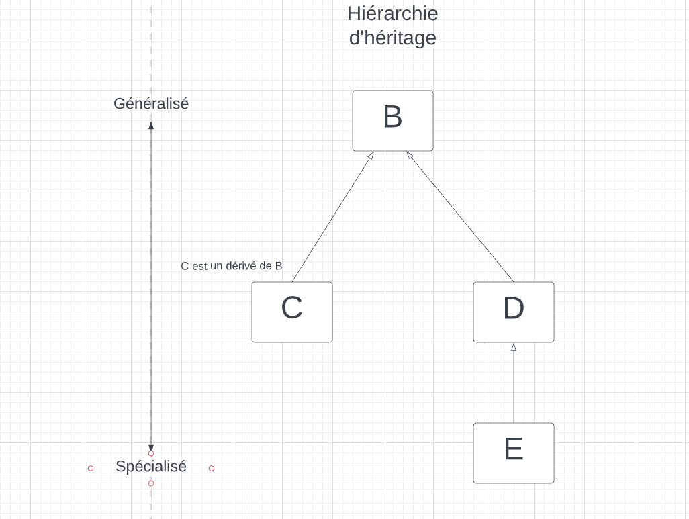

```cs
public class Personne
{

}

public class Enseignant : Personne
{

}

public class Etudiant : Personne
{

}
```


keyword `protected` : Dans la classe et ses dérivés \
keyword `private` : Même les dérivés n'ont pas accès \
Un enfant ne peut pas avoir 2 enfants

## Déclaration
```cs
// RARE
Personne unePersonne = new Employe(); // Légal
Employe unEmploye = new Personne(); // Illégal
unePersonne.NumeroEmploye = 10; // Ne marche pas
((Employe)UnePersonne).NumeroEmploye = 10; // marche
```

## Constructeur

```cs
public int Employe (int p_age, string p_nom, int p_noEmp) : base(p_age, p_nom)
{
  m_numeroEMploye = p_noEmp;
}
```

## Tableau
```cs
Personne [] lesPersonnes;
lesPersonnes = new Personne[10];
lesPersonnes[0] = new Personne();
lesPersonnes[1] = new Employe();
lesPersonnes[2] = new EmployeCadre();
lesPersonnes[3] = new Personne();
```

## if
````cs
if (lesPersonnes[i] is EmployeCadre) // Éviter le plus possibles
```

## Méthode
```cs
        public override String ToString()
        {
            String lunes = "";
            foreach (Lune r_lune in m_lunes)
            {
                lunes += r_lune.Nom + ", ";
            }
            return base.ToString() + ", Lunes : " + lunes;
        }
```