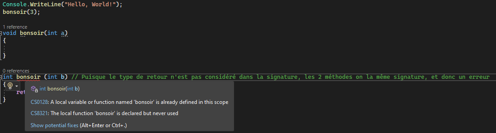

**IMPORTANT : Le document est en partie généré par chatGPT,** j'ai tout généré et modifié pour que ça fit avec les notes de cours mais vérifiez quand même par vous-même.

## Table des matières
- [Théorie POO (Question 1)](#théorie-orienté-objet-question-1)
- [Classe (Question 2)](#classe-question-2)
- [Flèches et relations (Question 2)](#flèches-et-relations-question-2)
- [GRASP (Question 3)](#grasp-question-3)
- [Patrons de conception (Question 4, 5 et 6) - PAS COMPLET](#patron-de-conception-gof-question-4-5-et-6)

# Théorie Orienté objet (Question 1)

## Qu'est-ce que la POO
La programmation orientée objet (POO) est une méthode de structuration de programmes qui regroupe des propriétés et des comportements dans des objets. Le but principal de la POO est d'augmenter la flexibilité et la maintenabilité du code.

## Pourquoi O.O?
  - robuste (résistant aux erreurs)
  - modifiable
  - travail d'équipe
  - compréhensible/convivial

## Classe et objet
Dans la POO, une classe est un modèle ou un plan qui définit ce que peuvent faire les objets de cette classe. Elle spécifie les champs et méthodes que chaque objet de cette classe aura. Un objet est une instance de cette classe. Il a un état (défini par ses champs) et des comportements (définis par ses méthodes).

## Statique vs Dynamique

Dans la POO, on parle d'éléments statiques et dynamiques. Les éléments statiques sont associés à une classe, tandis que les éléments dynamiques sont associés à des objets (instances d'une classe). Par exemple, en C#, une méthode statique appartient à la classe et peut être appelée sans avoir à créer une instance de cette classe. À l'inverse, une méthode non-statique (dynamique) doit être appelée sur une instance de la classe.

## Encapsulation

L'encapsulation est le mécanisme qui permet de regrouper les données (attributs) et les méthodes qui les manipulent en une seule entité, la classe. Cela permet de cacher les détails d'implémentation de la classe et de protéger les données internes.

## Héritage

L'héritage est un mécanisme qui permet de créer une nouvelle classe à partir d'une classe existante. La nouvelle classe hérite des champs et méthodes de la classe de base, ce qui permet de réutiliser le code existant et de faciliter l'extension des fonctionnalités du logiciel.

## Polymorphisme

Le polymorphisme est le mécanisme qui permet à une classe de prendre plusieurs formes. Cela signifie qu'une classe peut avoir plusieurs implémentations différentes, mais qu'on peut interagir avec elles via une interface commune.

Reformulation : Permet à une classe d'avoir plusieurs formes. Cela se produit lorsque nous avons une classe qui peut être utilisée comme son type de classe parent.

## Abstraction

L'abstraction est le processus de simplification de la représentation d'un système complexe en réduisant les détails inutiles et en mettant en évidence les aspects importants. Cela permet de gérer la complexité d'un logiciel en le divisant en classes et objets plus petits et plus gérables.

Reformulation : C'est une technique de dissimulation des détails et de montrer uniquement les fonctionnalités à l'utilisateur. Cela permet de simplifier la complexité en cachant les détails inutiles des utilisateurs.

## .NET
L'architecture .NET est un modèle de programmation qui prend en charge le développement et l'exécution d'applications logicielles. Elle comprend des langages de programmation tels que C#, VB.NET, F# et plus encore.

# Classe (Question 2)


## Données membres (ou attribut)
Les données membres sont les variables de la classe. Elle doivent être décalré dans la classe au début, à l'extérieur de toute méthode. \
Pour plus de claireté, on identifie les données membres par un `m_` ou un `_` : 
```cs
string m_person;
string m_nom;
int m_age;
```

## Constructeur
exemple 1:
```cs
public class ClassA
{
    // Données membres
    private int m_valueA;

    // Constructeur
    public ClassA(int valueA)
    {
        m_valueA = valueA;
    }
}
```
exemple 2:
```cs
public class Personne
{
    private string _nom;
    private string _prenom;
    private string _email;

    // Constructeur qui initialise tous les attributs
    public Personne(string nom, string prenom, string email)
    {
        _nom = nom;
        _prenom = prenom;
        _email = email;
    }

    // Constructeur qui initialise seulement le nom et le prénom, l'email est défini par défaut
    public Personne(string nom, string prenom)
        : this(nom, prenom, "non-renseigné")  // Utilisation du mot-clé "this"
    {
    }
}
```
Dans cet exemple, si une personne est créée en utilisant le second constructeur, l'email sera automatiquement défini à "non-renseigné".

## Propriétés
Dans C#, une propriété est une extension des champs de données et fournit un mécanisme flexible pour lire, écrire ou calculer la valeur des champs privés. Les propriétés peuvent être utilisées comme s'il s'agissait de variables publiques, mais elles sont en fait des méthodes spéciales appelées accesseurs. Cela permet aux données d'être accessibles facilement et en toute sécurité.
```cs
public class ClassA
{
    private int m_valueA;

    // Propriété ValueA
    public int ValueA
    {
        get
        {
            // "get" accessor: renvoie la valeur de m_valueA
            return m_valueA;
        }
        set
        {
            // "set" accessor: affecte la valeur à m_valueA
            m_valueA = value;
        }
    }
}
```

## Indexeurs
Dans C#, un indexeur est une syntaxe spéciale qui permet à une instance d'une classe ou d'une structure d'être indexée de la même manière qu'un tableau. En d'autres termes, vous pouvez accéder à des éléments d'un objet en utilisant l'opérateur d'indexation [].

```cs
public class ClassA
{
    int[] m_tab;
    public ClassA()
    {
        m_tab = new int[] { 23, 24, 25 };
    }
    public int this[int i]
    {
        get 
        {
            return m_tab[i];
        }
        set
        {
            m_tab[i] = value;
        }
    }
}
```

## Encapsulation
Tout ce qui est déclaré par une classe peut avoir une scope (variable, méthode...).

### Public
Accessible par tous \
Symbole dans le uml : +

### Private
Accessible par la classe seulement \
Symbole dans le uml : -

### Protected
Accessible par la classe et ses enfants \
Symbole dans le uml : #

## Signature
Il est possible d'avoir plusieurs classes avec le même nom, tant qu'ils n'ont pas la même signature (nom + type de paramètres). Noté que le type de retour ne compte pas dans la signature, et donc 2 méthode **ne peuvent pas** avoir le même nom, le même type de paramètre mais un type retour différent.
```cs
public int calculerPaye(int salaire, int jours) // Signature : calculerPaye int int
{
    // ...
}
public int calculerPaye(float salaire, int jours) // Signature : calculerPaye float int
{
    // ...
}
public int calculerPaye(int salaire, int jours, int bonus) // Signature : calculerPaye int int int
{
    return this.calculerPaye(salaire, jours) + bonus;
}

public double calculerPaye(int salaire, int jours, int bonus) // ERREUR
{
    // ERREUR, car elle possède la même signature que la méthode précédente.
}
```
Exemple visual studio:



## Surcharge d'opérateurs
```cs
public static Planete operator + (Planete partieGauche, Planete partieDroite)
{
  //code
}
```

## Héritage


```cs
public class ClassA
{

}
public class ClassB : ClassA
{

}
public class ClassC : ClassA
{

}
public class ClassD : ClassC
{

}
```

## keyword this
Exemple dans un constructeur: 
```cs
public class ClassA
{
    private int m_valueA;

    public ClassA(int valueA)
    {
        m_valueA = valueA;
    }

    public ClassA() : this(0)
    {
        // Cet appel de constructeur équivalent à :
        // public ClassA() {
        //    m_valueA = 0;
        // }
    }
}
```

Exemple pour une variable/méthode :

```cs
public class ClassA
{
    private int value;

    //...

    public int equal(int value)
    {
        return this.value == value;
    }
}
```

## Keyword base
Il est utilisé pour appeler la version de la méthode ou du constructeur de la classe de base à partir d'une classe dérivée.

### Avec des méthodes :
```cs
public class ClassA
    {
        public virtual int methodA()
        {
            return 1 + 2;
        }
    }
```

```cs
public class ClassB : ClassA
{
    public override int methodA()
    {
        return base.methodA() + 5;
    }
}
```

main :
```cs
ClassB objetB = new ClassB();

Console.WriteLine(objetB.methodA()); // 8
```

### Dans le constructeur :

```cs
public class ClassA
{
    private int m_valueA;

    public ClassA(int value)
    {
        m_valueA = value;
    }
}

public class ClassB : ClassA
{
    private int m_valueB;

    public ClassB(int valueA, int valueB) : base(valueA)
    {
        m_valueB = valueB;
    }
}
```

## Statique
Les variables/méthodes statiques se partagent entre tous les objets et sont accessibles (si public) sans avoir à instancié un objet (directement en appelant la classe)
```cs
// dans la classe
public static int m_age;

public static int calculerBMI()
{
  //... 
}
```
Il est impossible d'accéder au dynamique à partir du statique

## Abstraite
Une classe qui ne peut pas être instanciée directement. Elle sert de modèle/squelette pour les classes dérivées

## Méthode abstraite
C'est le squelette d'une méthode. Elle est **obligée** d'être **override** par ses enfants. Elle ne contient aucun code. \
Si l'enfant est lui aussi abstrait, il **n'a pas à override**. \
Seul le **premier enfant concrait** doit **override**.

```cs
public abstract class ClassA
{
  abstract public int MethodeA();
}
```

```cs
public class ClassB : ClassA
{
  public override int methodA()
  {
    return 4 + 8;
  }
}
```

## Méthode virtuel
une méthode qui peut être redéfinie dans une classe dérivée, permettant ainsi à la classe dérivée de fournir une implémentation différente de la méthode. (Override possible mais pas obligatoire) \
Similaire à la méthode `abstract` mais celle-ci contient du code. \
Un autre différence à noté : une méthode virtuel peut être déclaré dans une classe qui est abstraite ou non, alors qu'une méthode abstraite ne peut-être déclaré que dans une classe abstraite.

```cs
public abstract class ClassA
{
    public virtual int methodA()
    {
        return 1 + 2;
    }
}
```

```cs
public class ClassB : ClassA
{
    public override int methodA()
    {
        return 3 + 2;
    }
}

```

```cs
internal class ClassC : ClassA
{
      
}
```

main :
```cs
ClassB objetB = new ClassB();
ClassC objetC = new ClassC();

Console.WriteLine(objetB.methodA()); // 5
Console.WriteLine(objetC.methodA()); // 3
```

## new
le mot clé « new » masque explicitement un membre hérité d'une classe de base.
```cs
public class ClassA
{
    public int methodA()
    {
        return 1 + 2;
    }
}
```

```cs
public class ClassB : ClassA
{
    public new int methodA()
    {
        return base.methodA() + 5;
    }
}
```

## sealed
Une classe/méthode sealed ne peut pas hérité, c'est le dernier enfant.

```cs
  public sealed class ClassC
  {
    //...
  }
```

# Flèches et relations (Question 2)


## Composition :
- La composition est une relation "forte" entre deux classes, où l'objet "parent" contient l'objet "enfant".
- La durée de vie de l'objet "enfant" est liée à celle de l'objet "parent". Si l'objet "parent" est détruit, l'objet "enfant" est également détruit.
- L'objet "enfant" n'a généralement pas d'existence indépendante et n'est généralement pas partagé entre plusieurs objets "parents".

Dans cet exemple, la classe "Voiture" a une composition avec la classe "Moteur", car elle ne peut pas exister sans celle-ci. Le moteur est une partie intégrante de la voiture.

```cs
public class Voiture
{
    private Moteur _moteur;

    public Voiture(Moteur moteur)
    {
        _moteur = moteur;
    }
}

public class Moteur
{
    // Implémentation du moteur
}
```

## Aggrégation :
- L'agrégation est une relation "faible" entre deux classes, où l'objet "parent" utilise l'objet "enfant", mais l'objet "enfant" peutexister indépendamment.
- La durée de vie de l'objet "enfant" n'est pas liée à celle de l'objet "parent". Si l'objet "parent" est détruit, l'objet "enfant" peutcontinuer à exister.
- L'objet "enfant" peut être partagé entre plusieurs objets "parents".

Dans cet exemple, la classe "Cours" est une classe composite qui peut être constituée de plusieurs instances de la classe "Etudiant". Lorsqu'un cours est créé, aucun étudiant n'y est assigné. Des étudiants peuvent être ajoutés ou supprimés de ce cours à tout moment en utilisant la méthode "AjouterEtudiant()".

Notez que les instances de la classe "Etudiant" peuvent exister indépendamment de la classe "Cours", c'est pourquoi cette relation est considérée comme une aggrégation.

```cs
public class Cours
{
    private List<Etudiant> _etudiants = new List<Etudiant>();

    public void AjouterEtudiant(Etudiant etudiant)
    {
        if (!_etudiants.Contains(etudiant))
    {
        _etudiants.Add(etudiant);
    }
    }
}

public class Etudiant
{
    public string Nom { get; set; }
    public int Age { get; set; }
    // Autres propriétés et méthodes

    // Constructeur
    public Etudiant(string nom, int age)
    {
        Nom = nom;
        Age = age;
    }
}
```

## Association :
- L'association est une relation "forte" entre deux classes, où une classe (l'objet associé) est liée à une autre classe (l'objet associant) d'une manière spécifique et significative. Les objets associés peuvent avoir une relation bidirectionnelle ou unidirectionnelle,et ils peuvent se partager des données ou des actions.

Dans cet exemple, la classe "Commande" a une association avec la classe "Client", car les deux peuvent exister indépendamment l'un de l'autre. La commande peut être passée sans que le client ne soit connu et le client peut exister sans avoir passé de commande.

```cs
public class Client
{
    public string Nom { get; set; }
}

public class Commande
{
    public int Numero { get; set; }
    public Client Client { get; set; }
}
```

## Dépendance :
- La dépendance est une relation "faible" entre deux classes, où une classe (l'objet dépendant) utilise une autre classe (l'objet dépendance) dans une certaine mesure, sans que cela implique une relation plus forte comme dans le cas de l'association. La classe dépendante a besoin de la classe dépendance pour réaliser une certaine fonctionnalité.

Dans cet exemple, la classe "Facture" dépend de la classe "EnvoieService" pour l'envoi de la facture. La classe "Facture" utilise la classe "EnvoieService" pour réaliser une action spécifique. Si la classe "EnvoieService" est modifiée, cela peut affecter la classe "Facture".

```cs
public class Invoice
{
    public string CustomerEmail { get; set; }
    public double Amount { get; set; }

    // Constructeur
    public Invoice(string customerEmail, double amount)
    {
        CustomerEmail = customerEmail;
        Amount = amount;
    }

    // Méthode d'envoi de la facture qui dépend du service EmailService
    public void SendInvoice(EmailService emailService)
    {
        string message = $"Cher client, \n Veuillez trouver ci-joint votre facture d'un montant de {Amount}.\n Merci.";
        emailService.SendEmail(CustomerEmail, "Votre facture", message);
    }
}

public class EmailService
{
    public void SendEmail(string to, string subject, string message)
    {
        // Implémentation de l'envoi de l'email
    }
}
```

## Cardinalités


# GRASP (Question 3)

GRASP est l'acronyme de General Responsibility Assignment Software Patterns. Il s'agit d'un ensemble de principes ou de modèles utilisés en conception orientée objet pour assigner des responsabilités à des classes et des objets. Les modèles GRASP visent à fournir une approche pour résoudre les problèmes récurrents en matière de conception de logiciels.

## Expert
C'est le principe selon lequel les responsabilités doivent être assignées à la classe qui détient les informations nécessaires pour l'exécuter. Ceci contribue à la décentralisation des responsabilités, favorisant ainsi le masquage de l'information et le couplage. Les systèmes qui appliquent ce principe sont généralement plus faciles à comprendre et à maintenir.

Exemple: Supposons que nous avons une application de gestion d'une bibliothèque. Dans ce cas, une classe Livre pourrait être responsable de savoir si il est actuellement disponible ou non. Cette responsabilité serait affectée à la classe Livre car elle a toutes les informations nécessaires pour accomplir cette tâche (comme le statut actuel du livre).

## Créateur
Le principe Créateur est utilisé pour déterminer quelle classe est responsable de la création d'instances d'une autre classe. Cette responsabilité peut être déterminée par différents facteurs, tels que l'agrégation, la contenance, l'utilisation, ou si la classe détient les informations nécessaires pour initialiser l'instance de l'autre classe.

Exemple: Prenons un scénario où une classe Employé est chargée de la création de rapports d'activité. Dans ce cas, la classe Employé serait considérée comme un Créateur, car elle est responsable de la création de nouveaux objets de type Rapport.

## Faible couplage
Ce principe a pour objectif de minimiser les dépendances entre les éléments pour faciliter la maintenance. Un système avec un couplage faible possède peu de dépendances avec d'autres éléments. Cela évite les problèmes de compréhension des éléments séparément, facilite la réutilisation des éléments et minimise les modifications nécessaires lorsqu'un élément est modifié.

Exemple: Dans un système de commerce électronique, une classe Panier pourrait être conçue pour ne dépendre que d'objets de type Article, et non des détails de la facturation, du calcul des taxes, ou du système de paiement. Cela assure un faible couplage, ce qui facilite l'évolution et la maintenance de ces composants séparément.

## Forte cohésion
La cohésion se réfère à la mesure dans laquelle les responsabilités d'un composant ou d'une classe sont spécialisées. Une forte cohésion signifie qu'un composant ou une classe est très spécialisé et ne fait que ce qu'il est censé faire. Cela favorise la compréhension, la réutilisation, la maintenabilité du code.

Exemple: Supposons une classe GestionnaireDeTransactions dans une application bancaire. Cette classe se concentre uniquement sur les transactions bancaires, telles que les dépôts, les retraits et les transferts. Elle ne gère pas des responsabilités qui ne sont pas liées à ces transactions, comme la création de nouveaux comptes bancaires ou la gestion des clients, garantissant ainsi une forte cohésion.

## Contrôleur
Le principe Contrôleur est utilisé pour déterminer quelle classe est responsable de la réception et/ou du traitement des messages du système. Une classe Contrôleur doit être créée pour gérer les interfaces d'accès à un système, pour traiter les événements contenus dans un scénario d'utilisation, ou pour coordonner les différentes opérations. Les classes Contrôleur doivent être conçues pour être facilement réutilisées et comprises.

Exemple: Dans un jeu d'échecs numérique, la classe ControlleurEchecs pourrait recevoir les demandes d'actions des joueurs (telles que le déplacement des pièces ou la demande de rematch) et les coordonner avec les classes et méthodes appropriées pour effectuer ces actions.

## Fabrication Pure
Une fabrication pure est quelque chose créer de toute pièce, qui n'existe pas dans le monde réel. Ce principe vise à éviter qu'une classe ne fasse du "travail supplémentaire" qui pourrait aller au-delà de sa responsabilité principale. Il favorise ainsi la cohésion et le couplage faible.

Ces principes sont destinés à être utilisés comme guide lors de la conception d'un système. Ils aident à la distribution des responsabilités entre les classes d'une manière qui facilite la maintenabilité, la compréhensibilité, et la réutilisabilité du code.

Exemple: Dans un système de commerce électronique, une classe CalculateurDeTaxes pourrait être créée pour gérer les calculs de taxes sur les commandes. Cette classe n'existe pas dans le monde réel (elle est une "fabrication pure"), mais elle est créée pour avoir une meilleure organisation du code et pour éviter d'encombrer d'autres classes avec des responsabilités qui ne leur sont pas naturellement associées.

# Patron de conception GOF (Question 4, 5 et 6)

**J'ai pas terminé cette partie des notes**

Les patrons de conception sont des outils puissants pour les concepteurs de logiciels, leur permettant de résoudre efficacement des problèmes de conception spécifiques et de les appliquer de manière réutilisable à diverses situations.

---
## Patrons architecturaux
Les patrons architecturaux sont des modèles généraux qui guident la structure globale d'une application logicielle. Ils définissent la manière dont les différentes parties d'un système interagissent entre elles et comment elles sont organisées.

### Couches
Il est utilisé pour concevoir des logiciels appartenant à la même famille et utilisant une grande partie de code mutuel à tous les programmes. Les couches représentent un niveau de réutilisation du code, par exemple la suite Office de Microsoft.

### Pipeline
Ce patron décrit un système dans lequel des données sont introduites et traitées successivement par un ensemble de modules. Chaque module est en charge d'un aspect des traitements, formatage ou stockage des données.

### Modèle-Vue-Contrôleur (MVC)
Ce patron découpe une application en trois parties distinctes : le modèle (données), la vue (interface utilisateur), et le contrôleur (logique de traitement).

---
## Patrons de design
Les patrons de conception, également appelés "design patterns" en anglais, sont des solutions générales réutilisables à des problèmes communs dans la conception logicielle. Ils ne sont pas des conceptions finales qui peuvent être directement transformées en code, mais plutôt des guides pour résoudre des problèmes spécifiques de différentes manières. 

### Fabrique (Factory)
Ce patron est utilisé pour créer des objets sans exposer la logique de création à l'utilisateur. L'objet est créé dynamiquement en fonction des paramètres passés à la fabrique.

###  Prototype
Ce patron est utilisé lorsque la création d'une instance est complexe ou consommatrice en temps. Il permet de copier la première instance et de modifier la copie de façon appropriée.

### Singleton
Il assure qu'une classe n'a qu'une seule instance, et fournit un point d'accès global à celle-ci.


```cs
public class Singleton {

    // Crée une instance statique de Singleton
    private static Singleton instance;

    // Rend le constructeur privé afin qu'il ne puisse pas être instancié de l'extérieur
    private Singleton() {}

    // Fournit un point d'accès global à l'instance
    public static Singleton getInstance() {
        if (instance == null) {
            instance = new Singleton();
        }
        return instance;
    }
}
```

### Multiton
C'est une généralisation du patron Singleton, où au lieu d'avoir une seule instance par classe, on a un nombre limité d'instances.

### Object Pool (Pool d'objets)
Ce patron est utilisé pour gérer et réutiliser des objets coûteux à créer, comme des connexions à une base de données.

### Lazy Initialization (Initialisation paresseuse)
Ce patron crée un objet à la demande, lors de son premier usage, plutôt que lors de l'initialisation du système.


```cs
public class MyLazyClass
{
    private ExpensiveObject _object1;
    private ExpensiveObject _object2;

    public void UseObject1()
    {
        if (_object1 == null)
        {
            _object1 = new ExpensiveObject("Object1");
        }
        _object1.DoSomething();
    }

    public void UseObject2()
    {
        if (_object2 == null)
        {
            _object2 = new ExpensiveObject("Object2");
        }
        _object2.DoSomething();
    }
}

public class ExpensiveObject
{
    private string _name;
    
    public ExpensiveObject(string name)
    {
        _name = name;
        Console.WriteLine($"Creating ExpensiveObject {_name}...");
    }

    public void DoSomething()
    {
        Console.WriteLine($"{_name} is doing something...");
    }
}
```
Main:
```cs
static void Main(string[] args)
{
    Console.WriteLine("Program started...");

    MyLazyClass myClass = new MyLazyClass();

    Console.WriteLine("Ici");

    // Object1 n'est créé et utilisé que ici
    myClass.UseObject1();

    // Object2 n'est créé et utilisé que ici
    myClass.UseObject2();

    Console.WriteLine("Program ended...");
}
```

output:
```
Program started...
Ici
Creating ExpensiveObject Object1...
Object1 is doing something...
Creating ExpensiveObject Object2...
Object2 is doing something...
Program ended...
```

Cela montre que chaque objet ExpensiveObject n'est créé que lorsque sa méthode DoSomething est appelée pour la première fois.


### Adaptateur (Adapter)
Il permet de convertir l'interface d'une classe en une autre interface que le client attend. C'est souvent utilisé pour faire fonctionner ensemble des classes qui autrement ne le pourraient pas à cause d'incompatibilités d'interface.

### Composite
Il permet de traiter un groupe d'objets de la même façon que s'il s'agissait d'un seul objet. Les objets ainsi regroupés doivent posséder des opérations communes.

### Décorateur (Decorator)
Il attache dynamiquement de nouvelles responsabilités à un objet, offrant une alternative flexible à l'héritage pour composer de nouvelles fonctionnalités.

### Facade (Façade)
Elle offre une interface simple à un sous-système complexe, en cachant la complexité et en fournissant une interface unifiée aux utilisateurs.

### Proxy
C'est une classe se substituant à une autre classe, qui peut ajouter un niveau de contrôle des accès ou représenter localement un objet réseau plus lent pour augmenter la performance.

### Chaîne de responsabilité
C'est une série d'objets de traitement qui sont connectés en séquence. Un objet dans cette chaîne peut décider soit de traiter la demande et de la terminer, soit de la passer à l'objet suivant dans la chaîne.

### Commande (Command)
Il transforme une requête en un objet qui contient toutes les informations nécessaires à la requête.

### État (State)
Ce patron permet à un objet de modifier son comportement lorsque son état interne change.

### Visiteur (Visitor)
Il sépare l'algorithme du conteneur d'objet sur lequel il opère, permettant l'ajout de nouvelles opérations sans modifier les classes d'objets.

### Memento
Il offre la possibilité de restaurer un objet à un état précédent sans violer l'encapsulation.

### Stratégie (Strategy)
Il permet à une stratégie (méthode de traitement) d'être sélectionnée à l'exécution plutôt qu'à la compilation.
