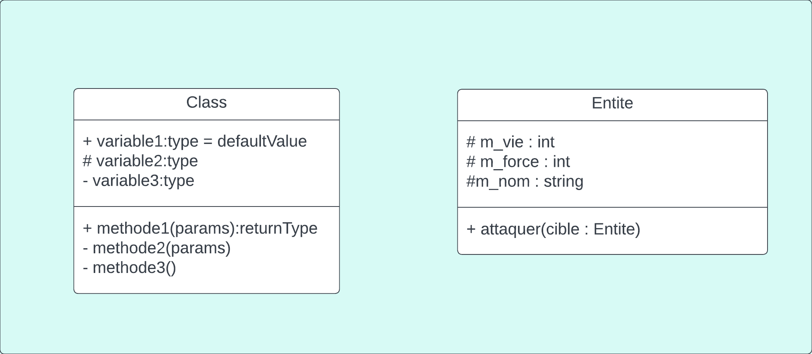
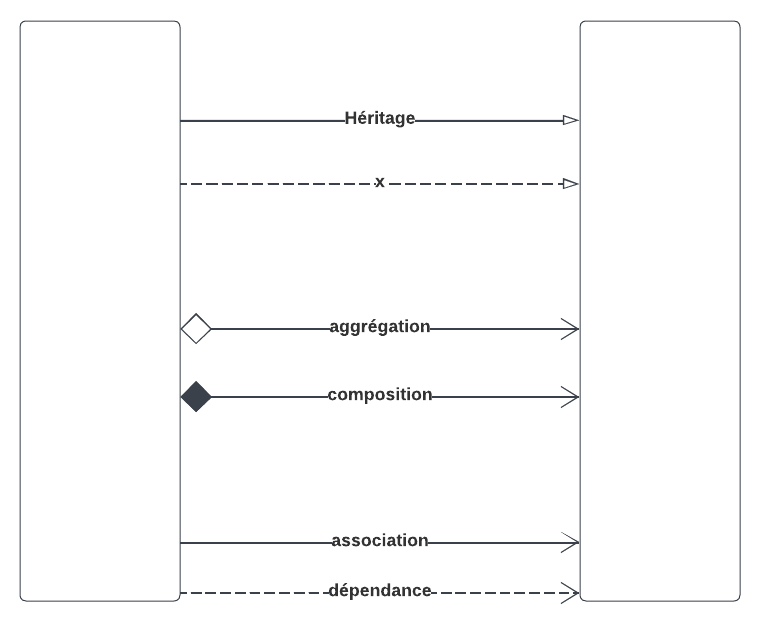
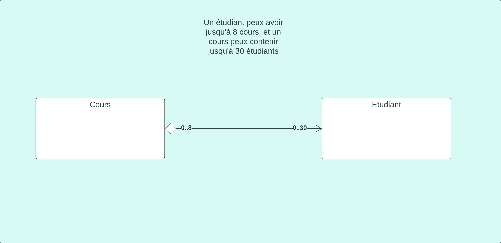

# C'est quoi l'approche O.O?
Consiste à organiser les programmes informatiques en utilisant des objets qui interagissent les uns avec les autres pour accomplir des tâches.

Un objet est une entité qui possède des propriétés (des attributs) et des comportements (des méthodes) spécifiques.

Le principe de base de la POO est d'encapsuler les données et les fonctions qui les manipulent dans des objets, de manière à ce que chaque objet soit responsable de son propre état interne et de son comportement. Cela permet de mieux structurer le code, de le rendre plus modulaire et plus facile à maintenir.

# Pourquoi O.O?
  - robuste (résistant aux erreurs)
  - modifiable
  - travail d'équipe
  - compréhensible/convivial

# Classe


## Données membres (ou attribut)
Les données membres sont les variables de la classe. \
Pour plus de claireté, il est possible de les déclarer ainsi :
```cs
string m_person;
string m_nom;
int m_age;
```

## Indexeurs
```cs
public class ClassA
{
    int[] m_tab;
    public ClassA()
    {
        m_tab = new int[] { 23, 24, 25 };
    }
    public int this[int i]
    {
        get 
        {
            return m_tab[i];
        }
        set
        {
            m_tab[i] = value;
        }
    }
}
```

## Encapsulation
Tout ce qui est déclaré par une classe peut avoir une scope (variable, méthode...).

### Public
Accessible par tous

### Private
Accessible par la classe seulement

### Protected
Accessible par la classe et ses enfants

## Signature
Il est possible d'avoir plusieurs classes avec le même nom, tant qu'ils n'ont pas la même signature (nom + type de paramètres)
```cs
public int calculerPaye(int salaire, int jours) // Signature : calculerPaye int int
{
    // ...
}
public int calculerPaye(float salaire, int jours) // Signature : calculerPaye float int
{
    // ...
}
public int calculerPaye(int salaire, int jours, int bonus) // Signature : calculerPaye int int int
{
    return this.calculerPaye(salaire, jours) + bonus;
}
```

main:
```cs
ClassA objetA = new ClassA();

Console.WriteLine(objetA[1]); //24
```

## Héritage


```cs
public class ClassA
{

}
public class ClassB : ClassA
{

}
public class ClassC : ClassA
{

}
public class ClassD : ClassC
{

}
```

## keyword this
```cs
public class ClassA
{
    private int m_valueA;

    public ClassA(int valueA)
    {
        m_valueA = valueA;
    }

    public ClassA() : this(0)
    {
        // Cet appel de constructeur équivalent à :
        // public ClassA() {
        //    m_valueA = 0;
        // }
    }
}
```

## Keyword base
Il est utilisé pour appeler la version de la méthode ou du constructeur de la classe de base à partir d'une classe dérivée.

### Avec des méthodes :
```cs
public class ClassA
    {
        public virtual int methodA()
        {
            return 1 + 2;
        }
    }
```

```cs
public class ClassB : ClassA
{
    public override int methodA()
    {
        return base.methodA() + 5;
    }
}
```

main :
```cs
ClassB objetB = new ClassB();

Console.WriteLine(objetB.methodA()); // 8
```

### Dans le constructeur :

```cs
public class ClassA
{
    private int m_valueA;

    public ClassA(int value)
    {
        m_valueA = value;
    }
}

public class ClassB : ClassA
{
    private int m_valueB;

    public ClassB(int valueA, int valueB) : base(valueA)
    {
        m_valueB = valueB;
    }
}
```

## Abstraite
Une classe qui ne peut pas être instanciée directement. Elle sert de modèle/squelette pour les classes dérivées

## Méthode abstraite
C'est le squelette d'une méthode. Elle est **obligée** d'être **override** par ses enfants. Elle ne contient aucun code. \
Si l'enfant est lui aussi abstrait, il **n'a pas à override**. \
Seul le **premier enfant concrait** doit **override**.

```cs
public abstract class ClassA
{
  abstract public int MethodeA();
}
```

```cs
public class ClassB : ClassA
{
  public override int methodA()
  {
    return 4 + 8;
  }
}
```

## Méthode virtuel
une méthode qui peut être redéfinie dans une classe dérivée, permettant ainsi à la classe dérivée de fournir une implémentation différente de la méthode. \ 
Similaire à la méthode `abstract` mais celle-ci contient du code. \ 
Un autre différence à noté : une méthode virtuel peut être déclaré dans une classe qui est abstraite ou non, alors qu'une méthode abstraite ne peut-être déclaré que dans une classe abstraite.

```cs
public abstract class ClassA
{
    public virtual int methodA()
    {
        return 1 + 2;
    }
}
```

```cs
public class ClassB : ClassA
{
    public override int methodA()
    {
        return 3 + 2;
    }
}

```

```cs
internal class ClassC : ClassA
{
      
}
```

main :
```cs
ClassB objetB = new ClassB();
ClassC objetC = new ClassC();

Console.WriteLine(objetB.methodA()); // 5
Console.WriteLine(objetC.methodA()); // 3
```

## new
le mot clé « new » masque explicitement un membre hérité d'une classe de base.
```cs
public class ClassA
{
    public int methodA()
    {
        return 1 + 2;
    }
}
```

```cs
public class ClassB : ClassA
{
    public new int methodA()
    {
        return base.methodA() + 5;
    }
}
```

## sealed
Une classe/méthode sealed ne peut pas hérité, c'est le dernier enfant.

```cs
  public sealed class ClassC
  {
    //...
  }
```

# Flèches et relations


**La section Flèches et relations est générés par chatGPT, à vos risques et périls :**

## Composition :
- La composition est une relation "forte" entre deux classes, où l'objet "parent" contient l'objet "enfant".
- La durée de vie de l'objet "enfant" est liée à celle de l'objet "parent". Si l'objet "parent" est détruit, l'objet "enfant" est égalementdétruit.
- **(À vérifier)** L'objet "enfant" n'a pas d'existence indépendante et ne peut pas être partagé entre plusieurs objets "parents".

Dans cet exemple, la classe "Voiture" a une composition avec la classe "Moteur", car elle ne peut pas exister sans celle-ci. Le moteur est une partie intégrante de la voiture.

```cs
public class Voiture
{
    private Moteur _moteur;

    public Voiture(Moteur moteur)
    {
        _moteur = moteur;
    }
}

public class Moteur
{
    // Implémentation du moteur
}
```

## Aggrégation :
- L'agrégation est une relation "faible" entre deux classes, où l'objet "parent" utilise l'objet "enfant", mais l'objet "enfant" peutexister indépendamment.
- La durée de vie de l'objet "enfant" n'est pas liée à celle de l'objet "parent". Si l'objet "parent" est détruit, l'objet "enfant" peutcontinuer à exister.
- L'objet "enfant" peut être partagé entre plusieurs objets "parents".

Dans cet exemple, la classe "Cours" est une classe composite qui peut être constituée de plusieurs instances de la classe "Etudiant". Lorsqu'un cours est créé, aucun étudiant n'y est assigné. Des étudiants peuvent être ajoutés ou supprimés de ce cours à tout moment en utilisant la méthode "AjouterEtudiant()".

Notez que les instances de la classe "Etudiant" peuvent exister indépendamment de la classe "Cours", c'est pourquoi cette relation est considérée comme une aggrégation.

```cs
public class Cours
{
    private List<Etudiant> _etudiants = new List<Etudiant>();

    public void AjouterEtudiant(Etudiant etudiant)
    {
        _etudiants.Add(etudiant);
    }
}

public class Etudiant
{
    public string Nom { get; set; }
    public int Age { get; set; }
    // Autres propriétés et méthodes

    // Constructeur
    public Etudiant(string nom, int age)
    {
        Nom = nom;
        Age = age;
    }
}
```

## Association :
- L'association est une relation "forte" entre deux classes, où une classe (l'objet associé) est liée à une autre classe (l'objetassociant) d'une manière spécifique et significative. Les objets associés peuvent avoir une relation bidirectionnelle ou unidirectionnelle,et ils peuvent se partager des données ou des actions.

Dans cet exemple, la classe "Commande" a une association avec la classe "Client", car les deux peuvent exister indépendamment l'un de l'autre. La commande peut être passée sans que le client ne soit connu et le client peut exister sans avoir passé de commande.

```cs
public class Client
{
    public string Nom { get; set; }
}

public class Commande
{
    public int Numero { get; set; }
    public Client Client { get; set; }
}
```

## Dépendance :
- La dépendance est une relation "faible" entre deux classes, où une classe (l'objet dépendant) utilise une autre classe (l'objet dépendance) dans une certaine mesure, sans que cela implique une relation plus forte comme dans le cas de l'association. La classe dépendante a besoin de la classe dépendance pour réaliser une certaine fonctionnalité.

Dans cet exemple, la classe "Facture" dépend de la classe "EnvoieService" pour l'envoi de la facture. La classe "Facture" utilise la classe "EnvoieService" pour réaliser une action spécifique. Si la classe "EnvoieService" est modifiée, cela peut affecter la classe "Facture".

```cs
public class Facture
{
    private EnvoieService _serviceEnvoie;

    public Facture()
    {
        _serviceEnvoie = new EnvoieService();
    }

    public void EnvoyerFacture()
    {
        _serviceEnvoie.Envoyer();
    }
}

public class EnvoieService
{
    public void Envoyer()
    {
        // Implémentation de l'envoi de facture
    }
}
```
# Cardinalités



# Données membres et méthodes en UML


- \+ : public
- \# : protected
- \- : private

<!-- 
- Question dans le même style que le mini-test

- Mise en situation, il faudra ensuite
  - Brainstorm entité
  - Définir les classes
    - noms
    - Données membres
    - héritage
    - composition / aggrégation
      - cardinalités
-->